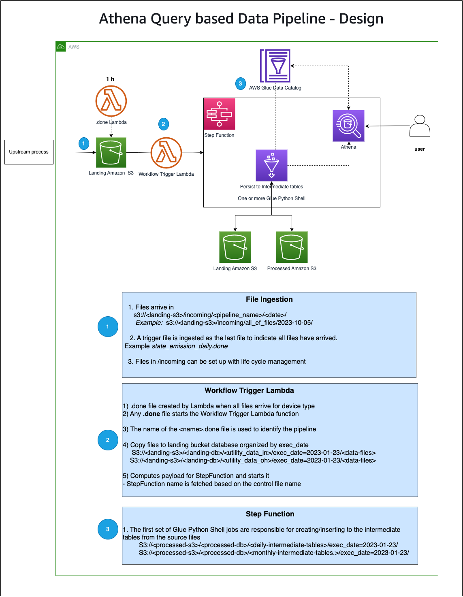
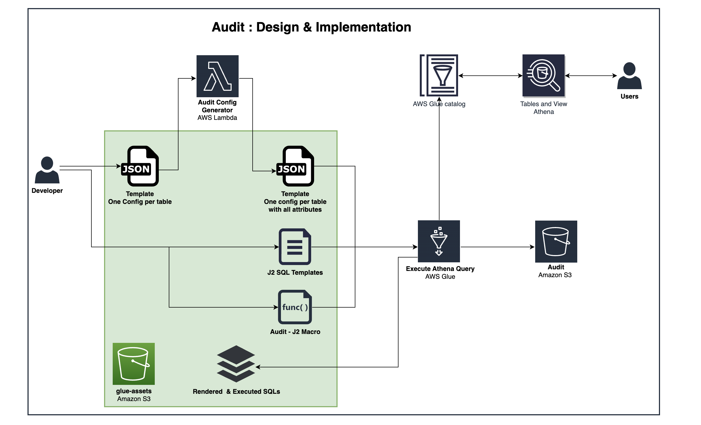
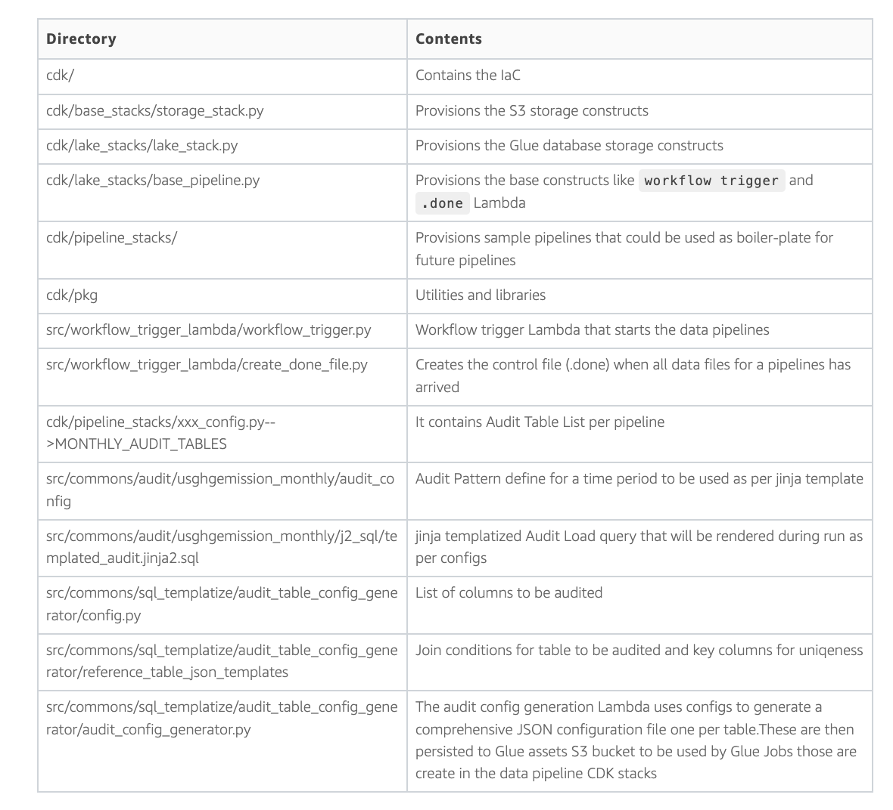

# sample-athena-based-glue-data-pipelines-via-step-functions
<h2>Purpose</h2>

The pattern presented here provides steps on how to build serverless ETL data pipelines with dependencies among them. Serverless constructs used are Amazon S3, AWS Glue, Amazon Athena to process data, AWS Lambda, AWS Step Function, and the AWS Cloud Development Kit (CDK) to automate and orchestrate the framework. Data pipelines are triggered when one more S3 file arrives. On data pipeline completion, dependencies can be set up for the subsequent pipelines. This framework has the ability to impose a configuration-driven approach to automate data lake storage constructs like Glue database & Glue table creation on S3.

This pattern will be pipeline-agnostic, so it’s easy to add new pipelines by following the principles outlined in the pattern.

<h2>Architecture Diagram</h2>

<h2>Audit feature</h2>

The data lake infrastructure also provides mechanisms to audit changes in key metrics by providing data lineage. These data lineage provide visibility into changes by traversing back from results all the way to source files. The data lineage is persisted to a Glue table in audit database. The purpose-built audit framework is a component that plugs into the GHG data lake and is entirely configuration driven.

The audit steps run as one of the last set of tasks in emissions calculation pipelines. The Audit has two major components.

<h5>Audit config generation</h5>
A pair of audit configurations are set up during data pipeline development. The audit config generation Lambda uses these to generate a comprehensive JSON configuration file – one per table. These are then persisted to Glue assets S3 bucket
<h5>Audit Metrics generation</h5>
The audit logic is executed via Glue Jobs those are create in the data pipeline CDK stacks
The audit glue jobs require two artifacts to capture change data sets,
The templatized SQLs that are used to generate hundreds of queries at runtime to generate the change data sets.
The configurations that are applied to the templatized SQL
<h2>Audit Architecture</h2>

<h2>code navigation</h2>
 
<h2>CDK deployment</h2>
<h3>Setup</h3>
<ul>
<li>Install cdk pack
<pre>To install CDK follow https://docs.aws.amazon.com/cdk/latest/guide/getting_started.html#getting_started_install
</pre>
<li>Install python dependencies
<pre>To install project deps run `poetry install`.</pre>
If you don't have poetry dependency manager installed, see: https://python-poetry.org/docs/
<li>AWS Setup
<pre>To run CDK commands, an awscli credentials / configuration will need to be setup for your AWS accounts.
</pre>
</ul>
<h3>Export environment variable</h3>
<pre>export CDK_DEFAULT_ACCOUNT="1234567890"</pre>
<pre>export CDK_DEFAULT_REGION="us-east-1"</pre>
<h3>CDK commands</h3>
<pre>

cd to cdk directory

To synthesize CloudFormation, run <b>cdk synth --profile profile</b> in repo root.

To see resource diff / changeset run <b>cdk diff --profile profile</b> in repo root.

To deploy run <b>cdk deploy --profile profile</b> in repo root.

</pre>
<h2>Pipeline Preparation</h2>
<h3>Update Database name, S3 bucket names, folder names, dev/prod stage names</h3>
<pre>update in src/workflow_trigger_lambda/config.py</pre>
<h3>Copy sample file</h3>
<pre>sh ./data/sampledata_withchecksum.sh</pre>

Note : Make sure download completes without any MD5 validation error.

<h3>Upload to landing bucket</h3>
<pre>aws s3 cp --recursive ./landing_files/ s3://apg-landing-$CDK_DEFAULT_ACCOUNT-dev/incoming/all_ef_files/2023-11-08/</pre>

<h3>Copy Athena sql and Python script file and Audit config files </h3>
<pre>aws s3 cp ./src/commons/execute_athena_query/exec_athena_query.py s3://apg-glue-assets-$CDK_DEFAULT_ACCOUNT-dev/glue_job_scripts/exec_athena_query/</pre>
<pre>aws s3 cp --recursive ./src/commons/execute_athena_query/scripts/ s3://apg-glue-assets-$CDK_DEFAULT_ACCOUNT-dev/execute-athena-scripts/</pre>
<pre>aws s3 cp --recursive ./src/commons/audit/usghgemission_monthly/j2_sql/ s3://apg-glue-assets-$CDK_DEFAULT_ACCOUNT-dev/audit/templatized_jinja2_sql/usghgemission_monthly/</pre>
<pre>aws s3 cp --recursive ./src/commons/audit/usghgemission_monthly/audit_config/ s3://apg-glue-assets-$CDK_DEFAULT_ACCOUNT-dev/audit/templatized_jinja2_sql/usghgemission_monthly/</pre>
<pre>aws s3 cp --recursive ./src/commons/sql_templatize/audit_table_config_generator/reference_table_json_templates/usghgemission_monthly/ s3://apg-glue-assets-$CDK_DEFAULT_ACCOUNT-dev/audit/templatized_table_config/usghgemission_monthly/</pre>
<pre>aws s3 cp --recursive ./src/commons/execute_athena_query/macros/ s3://apg-glue-assets-$CDK_DEFAULT_ACCOUNT-dev/j2-macros/</pre>
<pre>aws s3 cp ./src/commons/execute_athena_query/execute_batch_ddl_athena_j2sql.py s3://apg-glue-assets-$CDK_DEFAULT_ACCOUNT-dev/glue_job_scripts/execute_batch_ddl_athena_j2sql/</pre>
<pre>aws s3 cp --recursive ./src/commons/whl/  s3://apg-glue-assets-$CDK_DEFAULT_ACCOUNT-dev/whl/</pre>

<h3> Create landing tables</h3>
<pre>
CREATE EXTERNAL TABLE utility_data_in(
  plant_id_eia int,
  plant_id_epa int,
  emissions_unit_id_epa string,
  operating_datetime_utc timestamp,
  year int,
  state string,
  operating_time_hours float,
  gross_load_mw float,
  heat_content_mmbtu float,
  steam_load_1000_lbs float,
  so2_mass_lbs float,
  so2_mass_measurement_code string,
  nox_mass_lbs float,
  nox_mass_measurement_code string,
  co2_mass_tons float,
  co2_mass_measurement_code string
)
PARTITIONED BY (
  exec_date date)
ROW FORMAT SERDE
  'org.apache.hadoop.hive.ql.io.parquet.serde.ParquetHiveSerDe'
STORED AS INPUTFORMAT
  'org.apache.hadoop.hive.ql.io.parquet.MapredParquetInputFormat'
OUTPUTFORMAT
  'org.apache.hadoop.hive.ql.io.parquet.MapredParquetOutputFormat'
LOCATION
  's3://apg-landing-$CDK_DEFAULT_ACCOUNT-dev/landing_db_dev/utility_data_in'

msck repair table utility_data_in;
</pre>
<pre>
CREATE EXTERNAL TABLE utility_data_oh(
  plant_id_eia int,
  plant_id_epa int,
  emissions_unit_id_epa string,
  operating_datetime_utc timestamp,
  year int,
  state string,
  operating_time_hours float,
  gross_load_mw float,
  heat_content_mmbtu float,
  steam_load_1000_lbs float,
  so2_mass_lbs float,
  so2_mass_measurement_code string,
  nox_mass_lbs float,
  nox_mass_measurement_code string,
  co2_mass_tons float,
  co2_mass_measurement_code string
)
PARTITIONED BY (
  exec_date date)
ROW FORMAT SERDE
  'org.apache.hadoop.hive.ql.io.parquet.serde.ParquetHiveSerDe'
STORED AS INPUTFORMAT
  'org.apache.hadoop.hive.ql.io.parquet.MapredParquetInputFormat'
OUTPUTFORMAT
  'org.apache.hadoop.hive.ql.io.parquet.MapredParquetOutputFormat'
LOCATION
  's3://apg-landing-$CDK_DEFAULT_ACCOUNT-dev/landing_db_dev/utility_data_oh';

msck repair table utility_data_oh;
</pre>

<h3>Create processed tables</h3>
<pre>
CREATE EXTERNAL TABLE utility_emissions_daily(
  record_date date,
  co2_ton_oh float,
  co2_ton_in float,
  co2_ton_total float
)
PARTITIONED BY (
  exec_date date)
ROW FORMAT SERDE
  'org.apache.hadoop.hive.ql.io.parquet.serde.ParquetHiveSerDe'
STORED AS INPUTFORMAT
  'org.apache.hadoop.hive.ql.io.parquet.MapredParquetInputFormat'
OUTPUTFORMAT
  'org.apache.hadoop.hive.ql.io.parquet.MapredParquetOutputFormat'
LOCATION
  's3://apg-processed-$CDK_DEFAULT_ACCOUNT-dev/processed_db_dev/utility_emissions_daily';

msck repair table utility_emissions_daily;
</pre>
<pre>
CREATE EXTERNAL TABLE utility_emissions_monthly(
  record_month string,
  co2_ton_oh float,
  co2_ton_in float,
  co2_ton_total float
)
PARTITIONED BY (
  exec_date date)
ROW FORMAT SERDE
  'org.apache.hadoop.hive.ql.io.parquet.serde.ParquetHiveSerDe'
STORED AS INPUTFORMAT
  'org.apache.hadoop.hive.ql.io.parquet.MapredParquetInputFormat'
OUTPUTFORMAT
  'org.apache.hadoop.hive.ql.io.parquet.MapredParquetOutputFormat'
LOCATION
  's3://apg-processed-$CDK_DEFAULT_ACCOUNT-dev/processed_db_dev/utility_emissions_monthly';

msck repair table utility_emissions_monthly;
</pre>

<h3> Create Audit table</h3>
<pre>
CREATE EXTERNAL TABLE audit_db_dev.audit(
  layer varchar(50),
  attribute varchar(100),
  grain_key_1 varchar(100),
  grain_value_1 varchar(100),
  grain_key_2 varchar(100),
  grain_value_2 varchar(100),
  grain_key_3 varchar(100),
  grain_value_3 varchar(100),
  grain_key_4 varchar(100),
  grain_value_4 varchar(100),
  grain_key_5 varchar(100),
  grain_value_5 varchar(100),
  period date,
  curr_value varchar(100),
  prev_value varchar(100)
  )
PARTITIONED BY (
  pipeline varchar(50),
  exec_date date,
  table_name varchar(100),
  time_grain varchar(50)
  )
ROW FORMAT SERDE
  'org.apache.hadoop.hive.ql.io.parquet.serde.ParquetHiveSerDe'
STORED AS INPUTFORMAT
  'org.apache.hadoop.hive.ql.io.parquet.MapredParquetInputFormat'
OUTPUTFORMAT
  'org.apache.hadoop.hive.ql.io.parquet.MapredParquetOutputFormat'
LOCATION
's3://apg-audit-$CDK_DEFAULT_ACCOUNT-dev/audit_db_dev/audit/'
;
msck repair table audit_db_dev.audit;
</pre>

<h2>How to start the pipeline</h2>
<h3>Copy done file (state_emission_daily.done) to <b>incoming/all_ef_files/{{ exec_date }}/</b>  directory in S3.</h3>
<pre>touch state_emission_daily.done && aws s3 cp state_emission_daily.done s3://apg-landing-$CDK_DEFAULT_ACCOUNT-dev/incoming/all_ef_files/2023-11-08/</pre>
<h2>How to test Audit functionalities</h2>

A centralized CDC table is designed to compare current execution date to prior execution date for different stages in ETL tables for attribute values that needed to be tracked for changes.

The centralized table is designed to capture change in value of attributes from source to target. To capture multiple tables attributes changes in this single table CDC table have generic columns designed like tablename, pipeline, exec_date. Also because the tables being tracked can have different grain of uniqueness like Column1, (Column1,  Column2), Column2 etc. So in this design we kept few grain level keys and values that will be used to store attributes to capture difference per unique record.

<pre>Follw Testing steps from /audit_test/Audit_Testing</pre>
<h2>Disclaimer</h2>

Note, this solution relies on developers modifying the configuration with full power of SQL. As such, it is expected to be code reviewed for security vulnerabilities such as SQL injection with each commit. This solution does not have the guardrails in place to expose configuration outside of git to end users without additional input validation.

 
